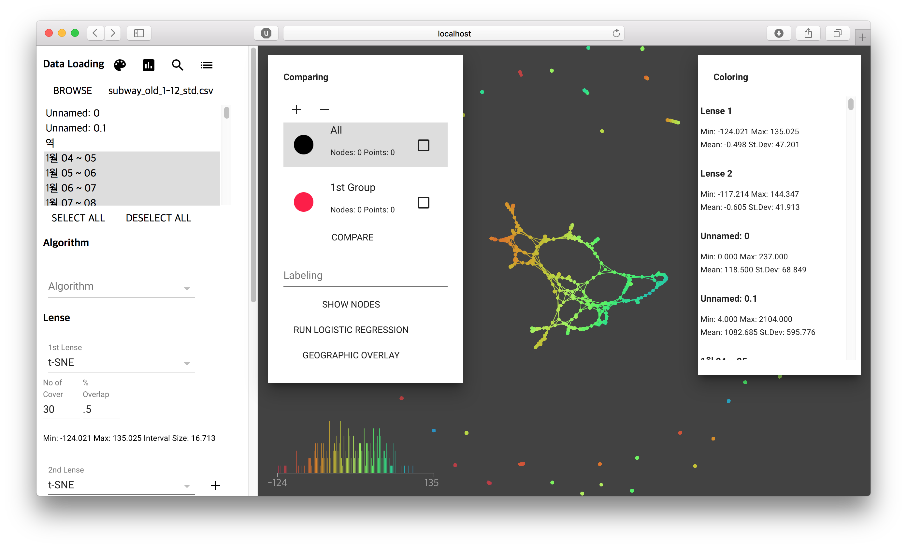

# Knotter
Implementation of Mapper algorithm for Topological Data Analysis

> G. Singh, F. Memoli, G. Carlsson (2007).  Topological Methods for the Analysis of High Dimensional Data Sets and 3D Object Recognition, Point Based Graphics 2007, Prague, September 2007.

## Installation

    pip install knotter

## Run web interface

    knotter

Basic usage is presented in the [Tutorial](docs/tutorial.md)