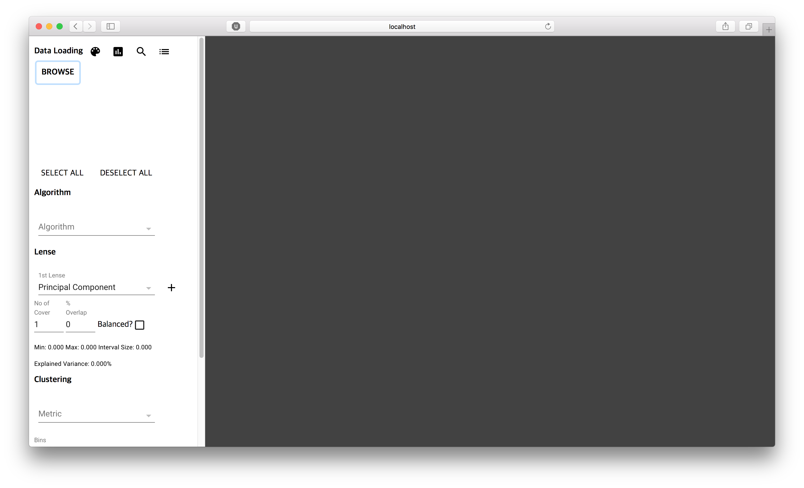
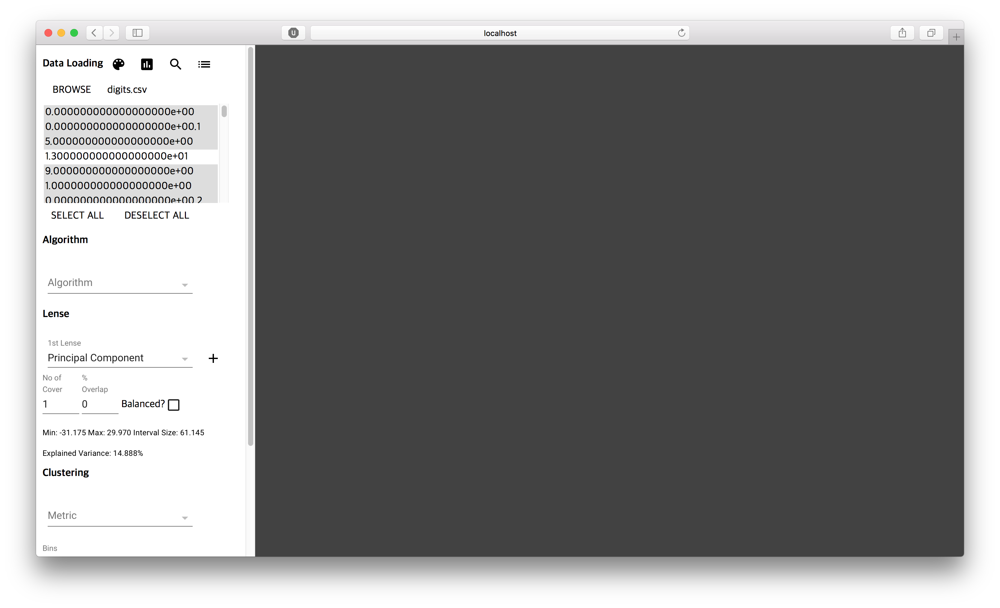
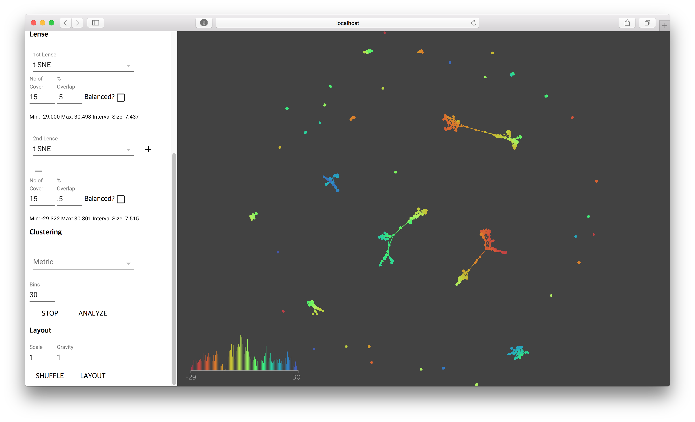
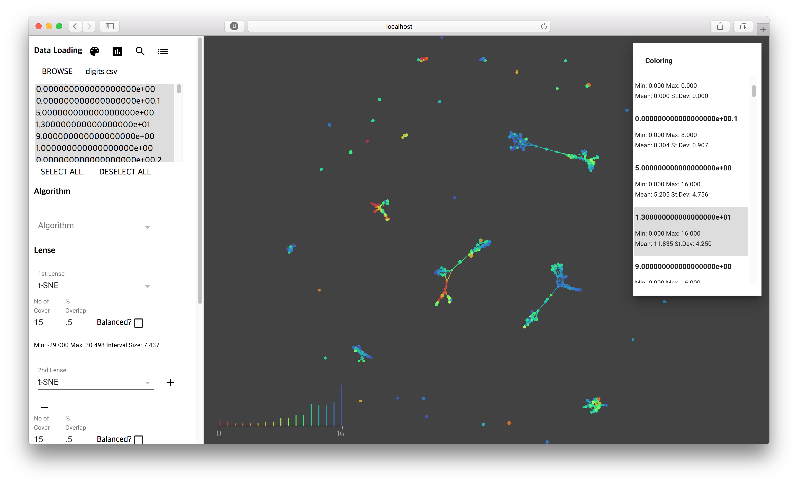
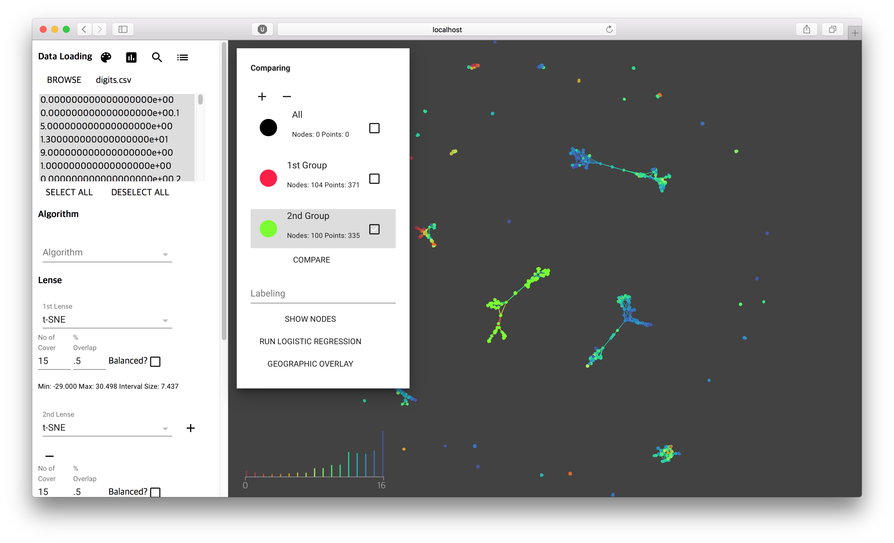
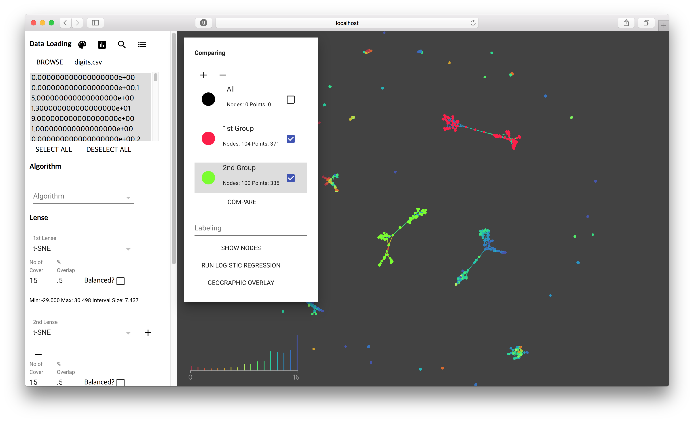
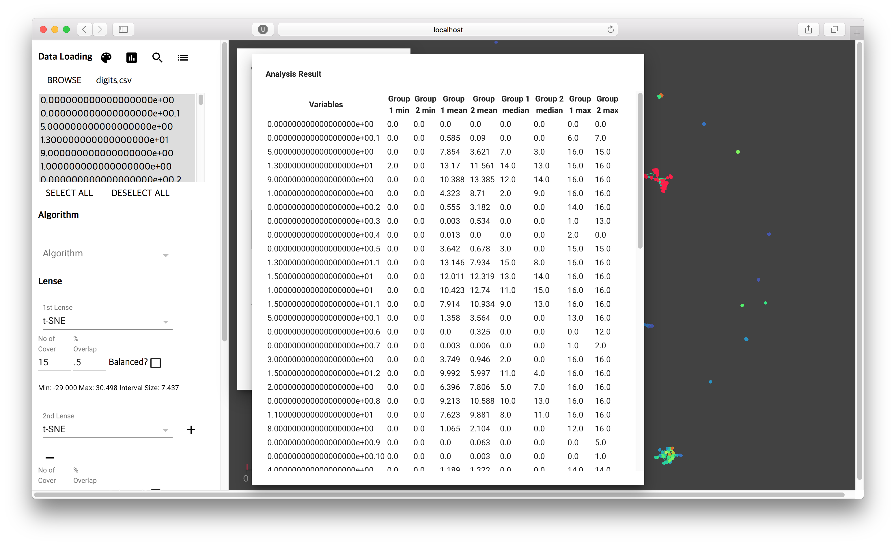

# Tutorial

This is initial screen after you launch knotter by

	$ knotter

You can import dataset using BROWSE button. CSV is supported.

After import data file, you can select variables that would be used for analysis.

Then you should set lense properties. You can add or remove lenses using [+] or [-] buttons. Then select lense functions like PCA or t-SNE, and set appropriate values for number of covers and % of overlap between covers.

After set the lense properties, you can click ANALYZYE button and you will get result. Resulting graph will layed randomly

You can use LAYOUT to layout graph in force layout algorithm. Also you can set Scale and Gravity parameter for force layout. If you want to reset layout, then use SHUFFLE button.

Post analysis can be done with 4 buttons in the top left corner. First, Palette-icon button will show up Coloring panel. In Coloring panel, you can color graphs using the value of variables.

Barplot-icon button will pop-up Comparing panel. In this panel you can add or remove groups using [+], [-] buttons. Select group, then right-click-and-drag in the graph will select nodes of graph. By this you can assign nodes you want to compare into groups.

Then check groups you want to compare, and click COMPARE button.

List-icon button (4th button) will show you Analysis Result window with statistics that you checked in Comparing panel.